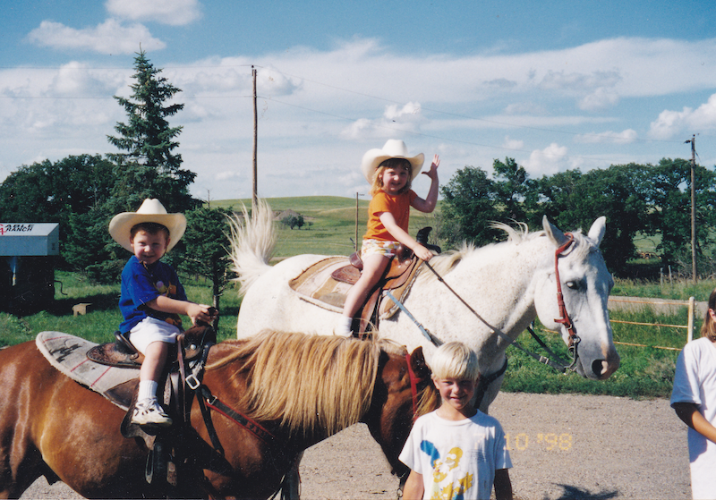
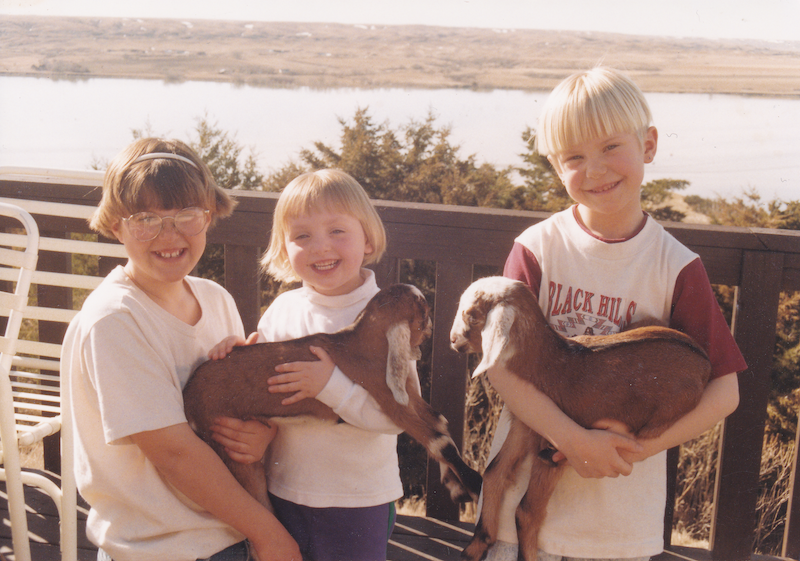
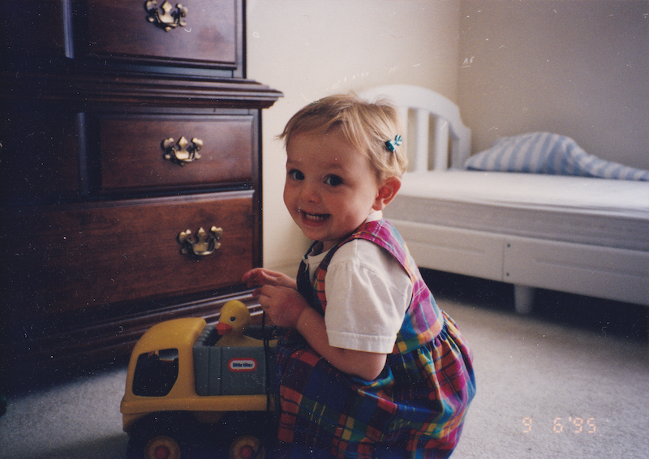
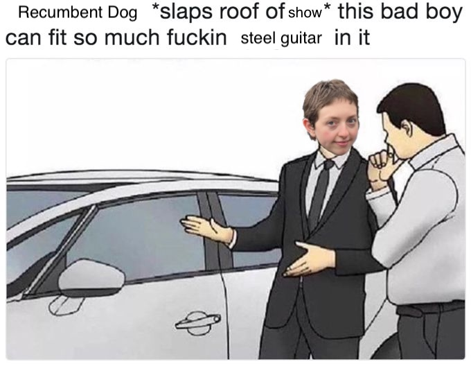
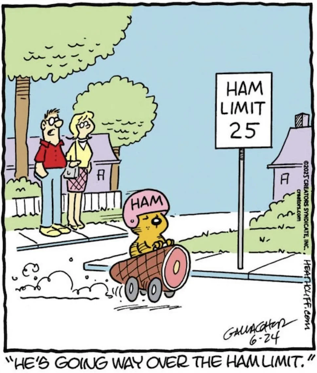

## From The Dog’s Desk

Breaker, breaker. This is The Dog on Recumbent Dog Radio, calling all my goers and goners.

Have I mentioned today that I’m from Texas? I feel like I talk about it too much, but 80% of the time I bring it up someone says “I don’t think I knew that." It’s key lore. I spent my childhoods splitting time between my mom in Texas and the Cable family in South Dakota. Here are some pictures of me as a child:

*Pukwana, SD on a horse at my aunt and uncle’s cattle farm*  

*Chamberlain, SD holding a goat on the back porch of my paternal grandmother’s bed and breakfast*  

*Wichita Falls, TX with my first truck in my maternal grandparent’s home*  

My paternal grandfather, Frank, was an owner operator truck driver. A few times when it was time for the Cable’s custody Frank would pick me up on a job and we’d drive from Wichita Falls to Chamberlain, it’s only 13 hours.

A few times my biological dad, we’ll call him Steve because it’s his name, drove the semi, or just picked me up in his Toyota Tacoma. Steve chewed Wintergreen Copenhagen tobacco and would spit into a Coca Cola can. We listened to the radio or Sheryl Crow albums. We’d break up the drive and stay a night in a roadside motel. He’d drop me off at the bed and breakfast and get back to work— sometimes driving the truck, or flying jets, or teaching folks to fly small planes. I’d be at the bed and breakfast, making beds and breakfasts for pheasant hunters, or down at the ranch running horses, collecting eggs, shearing sheep, etc.

If you’ve never ridden in a semi truck there are some things to note: They are much further off the ground than a commercial vehicle, it’s like flying above the highway. Behind the driver/passenger seats is a sleeper, basically a thick cot, so a driver can pull over and sleep in the cab. Most drivers keep a CB radio in the truck to communicate with other truckers. This wiki on CB lingo does a pretty good job, but I think it can be kind of up to interpretation/ regional. Generally you catch the meaning in the context of a conversation. This will be on the test!

The best gas stations are Pilot and Love’s. I love a roadie sodie, bbq sunflower seeds, squeegeeing the windshield, exfoliating Gojo cherry handsoap, hitting the slot machines while your laundry runs, big pickle in a barrel.

What is gas station music? It’s not about traveling, it’s about being on the road. It’s listless. It’s lonesome. It’s going just to be going, to some extent going just to be gone.

-R

### Tracklist

She Ain’t Going Nowhere, Guy Clark  
Actin’ Ugly, Hiding Places  
In the Saddle, Whitney  
Anybody, Sam Evian  
Shuffle, Poor Image  
Coping Mechanism, Car Culture  
Angels, Shallowater  
Honk If You’re Lonely, Silver Jews  
My Life Is a Pizza Party/(The Last Time), Talons’  
Love Vape, Friendship  
Coast, Snocaps  
Wild Sage (The Jordan Lake Sessions Volume 4), The Mountain Goats  
I Never Get Lonesome, Arthur Russell  
To Live Is To Fly, Townes Van Zandt  
Northwest Passage, Allan Wachs  
Riding For The Feeling, Bill Callahan  

### Notes

**She Ain’t Going Nowhere, Guy Clark**  
I watched Heartworn Highways 1976 this month, featuring Guy, Townes, David Allan Coe, Steve Earle, Rodney Crowell, Larry Jon Wilson, Gamble Rogers, Steve Young, Charlie Daniels etc.. The cover of this note is a picture I took of the movie projected up on my wall, Wilson in the studio just loving the tone… the lonesomest sound.

Some folks are goers, and others hold it down. Guy Clark ain’t a goer, him and Suzanna Clark held a home to gather drunks and hippies, a place for Townes to land. This track is (sad) about Bunny Talley, Suzanna’s sister/ Guy’s girlfriend until the time of her death in 1970. It’s a thematically load bearing song in this episode.

*She ain't goin' nowhere, she's just leavin'*  
*She ain't goin' nowhere she can't breathe in*  
*And she ain't goin' home, that's for sure*  

There’s some great scenes in Heartworn Highways of Guy at home, drinking red wine, smoking cigarettes, building guitars. My favorite Guy Clark album is Texas Cookin’, it’s absolutely perfect top to bottom.

**Actin’ Ugly, Hiding Places**  
I was at a Hiding Places show on October 10. Mariah Houston shared that a friend had overheard a track of theirs playing at a gas station. Someone in the band said “this is gas station music” and I was Inspired™. I heard Hiding Places for the first time when they played with Fraternal Twin in July and I thought “I bet these guys dig Friendship.” I saw them all roll up to the sold out Friendship (9) show the following night. The cover of this album, The Fly, has a picture of a car with the hood up. Gas station music.

**In the Saddle, Whitney**  
Followed Max Kakacek to the greenroom at the Small Talk release show and made a joke of myself spilling that he’s one of my favorite guitarists. He shared that his faves right now are Emily Green (Geese) and Patrick Flegel (Cindy Lee.) God I’m stoked to see Cindy Lee this weekend!

I meant to ask about his guitar. Telecaster made out of a stunning piece of wood, grain exposed, no pick guard, Bigsby. I pumped my fist every time he put the finger slide on his pinky.

*Mesmerized*  
*Got twenty years to burn*  
*and half a mind*  
*to hit the road*  
*Hope nobody knows*  
*I’m riding high in the saddle*  
*Going nowhere, but I’m going*  

**Anybody, Sam Evian**  
Another thematically load bearing song. This whole album is on theme. After you finish this, go listen to all these albums and then come back and listen to my show again. If you were gonna be on the road for a few hours, I’d totally suggest queuing up all of these albums and just letting it rip through you.

Sam Evian is on my “perfect catalogue” list. He has a studio up in the Catskills and when I lived up there I would listen to his music with my windows down and felt sure that knew what he was talkembout. First heard him at a Cosmic Country Showcase in Chicago. Quick tally on places I’ve hung my hat: Jacksonville, FL; Wichita Falls, TX; Chamberlain, SD; College Station, TX; Chicago, IL; Nashville, TN; Delhi, NY; Brooklyn, NY.

*Tossed my name out to the wind*  
*felt my weathered life divide*  
*Thought of my dear family*  
*the friends I left behind*  
*Thoughts like that bring me to my knees*  
*I strike 'em from my mind*  
*And now my home is everywhere*  
*I sleep beneath the sky*  
*No government to care for me*  
*but I'll get mine*  

**Shuffle, Poor Image**  
Fresh release, cool slowcore, and ya, more steel.

Really suggest listening to the whole album. “Sometimes” has some motherfuckin fiddle on it. I feel lucky to be alive while young people are making great country music.

*It’s easy to get lost if you let it loose*  
*Seems controls the only thing that you’re afraid to lose, it’s no excuse*. 

**Coping Mechanism, Car Culture**  
Hey! Gotta get some fresh Car Culture on the mix, I live on the Bushwick/Ridgewood border after all. Why is it on theme? Hmmm. Let me think, well aside from the perfectly lonesome sound on the guitar, the artist is Car Culture! Next!

**Townes Van Zandt on aloneness**  
I also watched a Townes doc, *Be Here To Love Me*, this month. It includes some performance footage, a couple interviews with Townes, a few phone calls, a handful of interviews with folks that knew him. Most of it is shots of rural America viewed from a moving car.

**Angels, Shallowater**  
This song mentions “wandering” and “cold coffee” which is totally gas station coded.

They also make a solid Country Music joke about Honky Tonk Angels, referring to “It Wasn’t God Who Made Honky Tonk Angels” by Kitty Wells (penned by Jay Miller), which was a clapback of sorts to “The Wild Side of Life” by Hank Thompson. Lord knows I love a wink and a nod.

Shallowater put out an album this year, I suggest you check it out. They describe their sound as “raw West Texas dirtgaze.” God bless Texans.

**Honk If You’re Lonely, Silver Jews**  
I love when a kinda silly song starts with a tiny drum run of sorts and I can put it just after a joke like: [Comic Rimshot](https://www.youtube.com/watch?v=9CdVTCDdEwI)

This is less gas station music and more roadside bar music about Honky Tonk Angels (promiscuous women) in the spirit of [“Give Back My Heart,” Lyle Lovett](https://www.youtube.com/watch?v=UqYMf_IEvMg), or [“Rita Ballou,” Guy Clark](https://www.youtube.com/watch?v=OyTuO0FkeTs), or ["Papa Was a Rodeo,” Magnetic Fields](https://www.youtube.com/watch?v=OekbKN0TeDI), etc. This could have been a very long playlist.

**My Life is a Pizza Party/ (The Last Time), Talons’**  
Mike Tolan saying “Jesus christ” under his breath right after the little honk honk at the end of “Honk If You’re Lonely” sounds like Tolan and Berman are passing each other in opposite directions on the same highway.

Rustic Bullshit is a perfect 24:23 long recording. I know every ache, tape click, whispered expletive, crunch of gravel beneath shoes. I picked up a copy after a show in the garage behind Erik Czaja’s house next to the Hot Doug’s in Avondale. I went with my first boyfriend, who had the same name as [an expressway](https://en.wikipedia.org/wiki/Dan_Ryan_Expressway). Ha! Everything is related. He lived north of the city. The hottest thing a man can be is out of town.

**Rhinestone Cowboy looking for a front door**  
A clip from Heartworn Highways. Before Glen Campbell wrote his hit, David Allan Coe was “The Mysterious Rhinestone Cowboy” and wore a Zoro mask and rhinestone boots and tassels and the occasional Nudie suit. If you didn’t study the CB radio guide from earlier, see below translation.

Rhinestone Cowboy: David Allan Coe  
Front Door: someone to drive along, in front of ya to keep a look out for Bears (cops), as to allow the requestor to speed to their destination  
Chicken Coop: Weigh station  

This is a Country and Western Show by [David Allan Coe Standards](https://youtu.be/s4pZFsEdP3Y?t=184). We have a prison ref on “She Ain’t Going Nowhere” and coming up on “Wild Sage.” Talks of a train on “Angels.” Kind of a getting drunk nod on “Coast.” Mom mention on “My Life is a Pizza Party.” Lots of cars in this, surely one of them is a pickup truck.

Halfway through now. We gotta clean bill of health all the way home.

**Love Vape, Friendship**
Caveman Wakes Up is on my AOTY shortlist, for whatever that’s worth. Literal gas station mention on this track. This is a thinking man’s “radio” show.

*Kind of freaky at the BP down off Locust*  
*I heard they got the cheapest cigarettes on Earth*  
*They still give you plastic bags*  
*Rolling shutters covеred in tracks*  
*Somebody's name writtеn on the overpass*  
*Did they have to hang upside down?*  

They’ve got a song called “Kum & Go” on Love the Stranger. Friendship is gas station music.

I don’t have the right musical language to explain why I think this song sounds like [“History Lesson Part II,” Minutemen](https://www.youtube.com/watch?v=KZvsAh5VFRw). That’s one of those songs that’s objectively better than other songs. Rare air. I think the thing I’m hearing is kind of a similar drum sound + a consistent base line + bright wandering guitar sound running over it. Something like that. Hey if you’ve been doing your homework, what does *Double Nickels on the Dime* mean?

**Coast, Snocaps**
Snocaps is gonna be the first Crutchfield project I haven’t seen live on their first tour. I got locked out by Ticketmaster for suspicious browser activity and by the time I logged in from a different location tickets were sold out. Anyway I actually blame MJ Lenderman for this and I will have justice.

Surprise Snocaps album doesn’t have a surprising sound, but I don’t need it too. The album reminds me of taking public transit to pick up drunk boyfriends from the bar and driving them home in their own cars. This song makes me think of how when I ask someone what’s up and they say “Same old thing” I think “I haven’t related to that sentiment since like 2018.” I can never just coast!

No one asked but in the non-existent Allison vs Katie supremacy debate, I’m an Allison girl.

Lots of driving on this, and a Heathcliff the cat reference! Here’s both:

**Wild Sage (The Jordan Lake Sessions Volume 4), The Mountain Goats**
If I’ve ever forgotten your name I hope you’ll take solace in the fact that I do remember the words to every single song by John Darnielle recorded or live 1994 - 2012 + Bleed Out, 2022.

I love every lyric to this song but for space I’ll just put this clip here. Requisite dog reference (sad).

*And along the highway*  
*Where unlucky stray dogs bleed*  
*Wild sage growing in the weeds*  
*On some days I don't miss my family*  
*On some days I do*  
*On some days I think I'd feel better if I tried harder*. 
*Most days I know that's not true*

Lately I’ve noticed that when someone asks me how I am over the phone— friends, job interviewers, customer service reps— I look up and describe the sky, the clouds, the quality of light, the temperature, the color of the leaves in the park today. How am I? I am. How’s life? It is.

**I Never Get Lonesome, Arthur Russell**  
I don’t always put an Arthur Russell song on the show, but I usually do. If I have a question, Arthur usually has an answer.

**To Live Is to Fly, Townes Van Zandt**  
Van Zandt regarded this as one of his best, me too. I don’t have much to say, he says it all.

*Where you been is good and gone*  
*All you keep is the getting there.*  

**Northwest Passage, Allan Wachs**  
Should you survive me, please take those guys who play Irish music down at Hartley’s on Mondays on a hike and have them play this at the top of a mountain. All the lyrics are relevant, beautiful, perfect, here are some of my favorite.

*So I learned to make some money*  
*And I learned to make some friends*  
*I learned to take my time with things*  
*And I learned to make amends*  
*I learned to build a fire*  
*Though there’s times when I’m still cold*  
*I learned what can’t be boughten*  
*And I learned what can’t be sold*  

later  
*I'm as thankful for hard changes*  
*As I'm thankful for good days*  
*But if I found a home or not*  
*Well, I can't really say*  

**Riding For The Feeling, Bill Callahan**  
I have this condition where when a Bill Callahan song comes on I have to turn out all the lights and sit in an empty room with my head in my hands like a dad with a migraine. Thematically load bearing track, the title says it even. You can take things from here.

[link to show](https://www.mixcloud.com/recumbentdog/gas-station-music/)

additional media in order of mention:  
[Heartworn Highways](https://share.google/tYrMJ03t8NCtWRLYG)  
[Mariah Houston](https://mariahhouston.bandcamp.com/)  
[Geese](https://geesebandnyc.bandcamp.com/album/getting-killed) (This feels so hype that it feels silly to link, but maybe one day not everyone will cross paths with Geese every hour on the hour. I like it, it’s good, it’s… we’re not getting into this in the footnotes!)  
[Cindy Lee](https://cindylee.bandcamp.com/album/diamond-jubilee) (Also hype, could always be hype-r)  
[Cosmic Country Showcase](https://www.instagram.com/cosmiccountryshow)  
[Be Here To Love Me](https://share.google/hmrXDA5lAKfS6ab3u)  
[We Jam Econo](https://share.google/pGxe2YmZY7RZW7Wsj)  
[American Sunset, An Hour of Cosmic Americana](https://www.nts.live/shows/guests/episodes/american-sunset-25th-may-2020)  