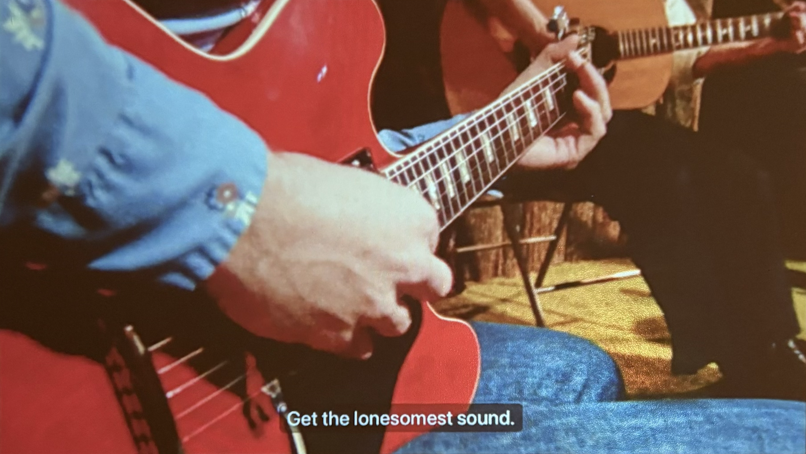

## notes

  

    
2025.11.09

  

  <h3>gas station music</h3>
  
  
It’s not about traveling, it’s about being on the road. It’s listless. It’s lonesome. It’s going just to be going, to some extent going just to be gone.

  <a href="gas-station-music.html"><button class="button">read</button></a>

  

    
2025.10.10

  

  <h3>bias cut</h3>
  
  
Selections for getting ready to go out: Sexy alternative pop, 90’s/2000’s avant garde electronics, upbeat club considerations, a little disco, slow dancing alone, hoping to run into someone, one martini, music playing from the other room while you put on your earrings.

  <a href="bias-cut.html"><button class="button">read</button></a>

  

    
2025.05.15

  

  <h3>straight line</h3>
  
  
Sonically, this mix has a lot of whirrs, beeps, static, feedback, and guttural screaming. It’s… a little annoying. My yoga teacher might call it “agitating.” Agitation fights stagnation. Get uncomfortable.

  <a href="straight-line.html"><button class="button">read</button></a>

  

    
2025.04.02

  

  <h3>head through the window</h3>
  
  
Dirtbags are back, throwing back a couple of beers on a weeknight is back, groceries are getting more expensive but cigarettes are staying the same price.

  <a href="head-through-the-window.html"><button class="button">read</button></a>

